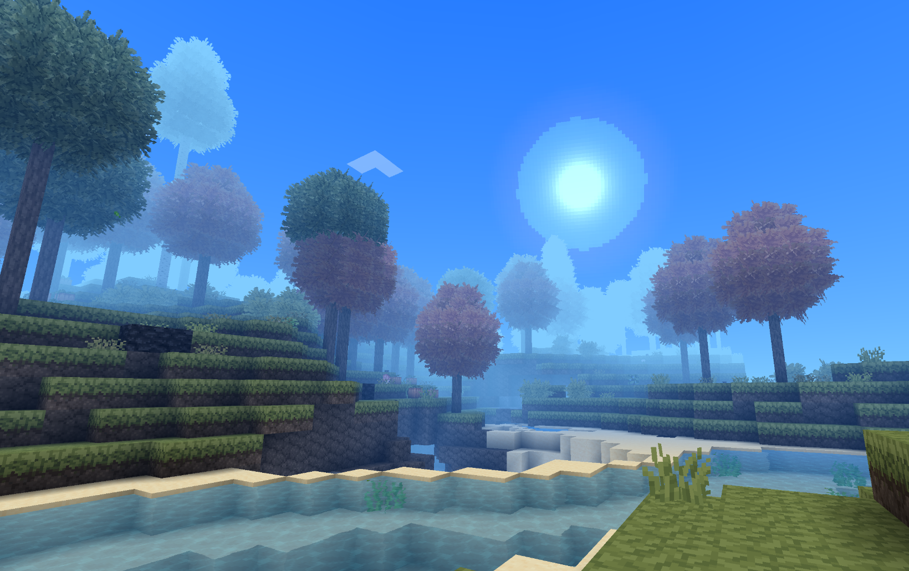
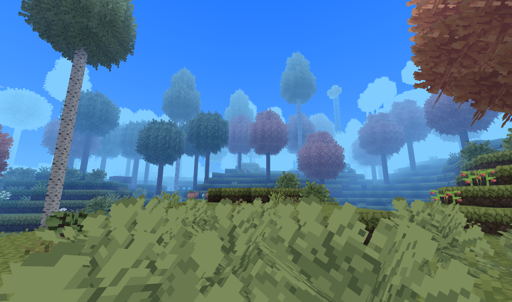
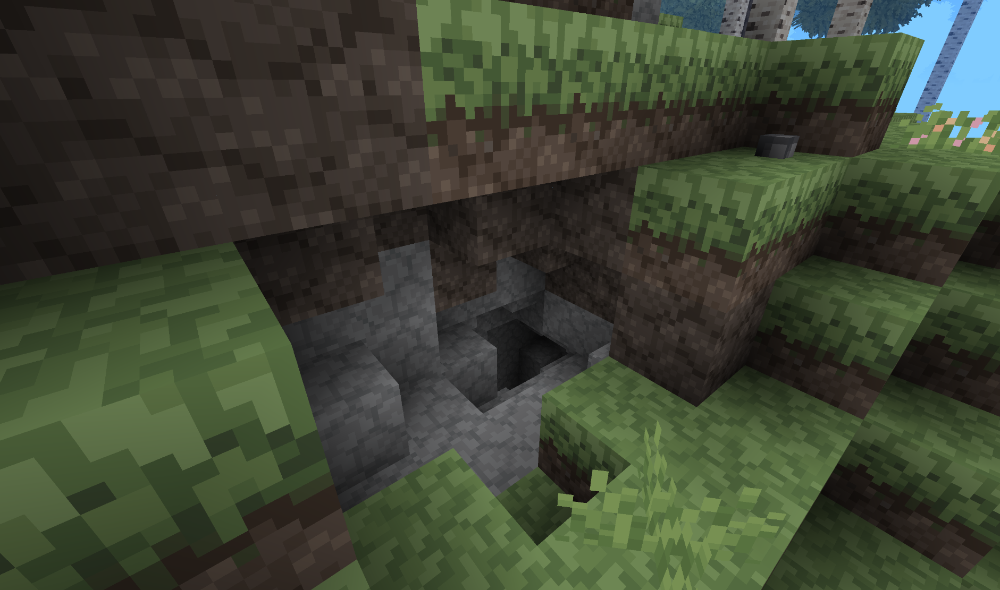
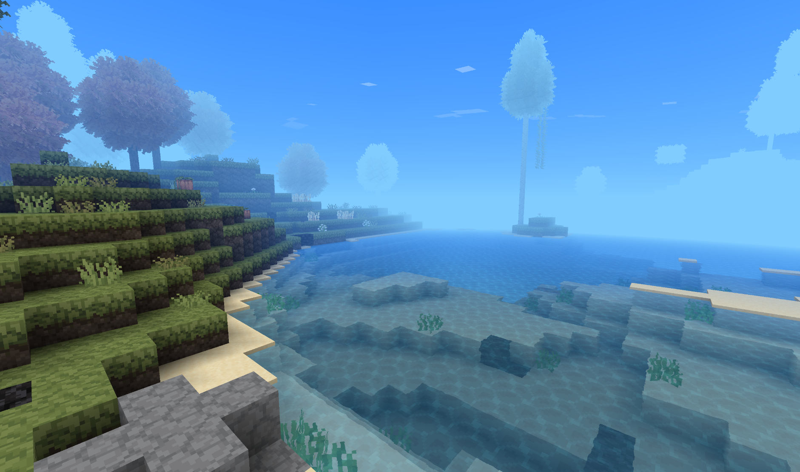

  
  <h1>Unknown Texture</h1>
  <h2>A quiet and lonely world...</h2>
  <h3>! We recommend reducing the render distance to 2 for a better experience !</h3>

 
  
Imagine the world of Allumeria—so colorful and fun,
transforming into a completely different world...
  
Imagine yourself in the vast world of Allumeria, filled with various dungeons and monsters, combined with a texture pack that evokes a vintage feel and an air of mystery. It’s as if this world wants to tell you something—but what?

## Screenshots

  <table>
  <tr>
    <td align="center">
    <td align="center">
  </tr>
  <tr>
    <td align="center">
    <td align="center">
  </tr>
</table>

## [Download Asset Pack](https://github.com/WiqbalRar/Unknown-Texture/releases)

I hope you like my work :)</h2>

